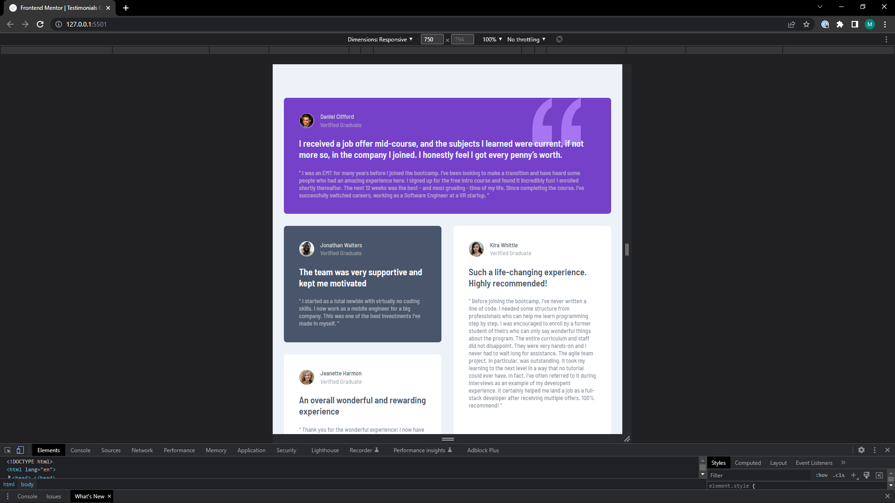
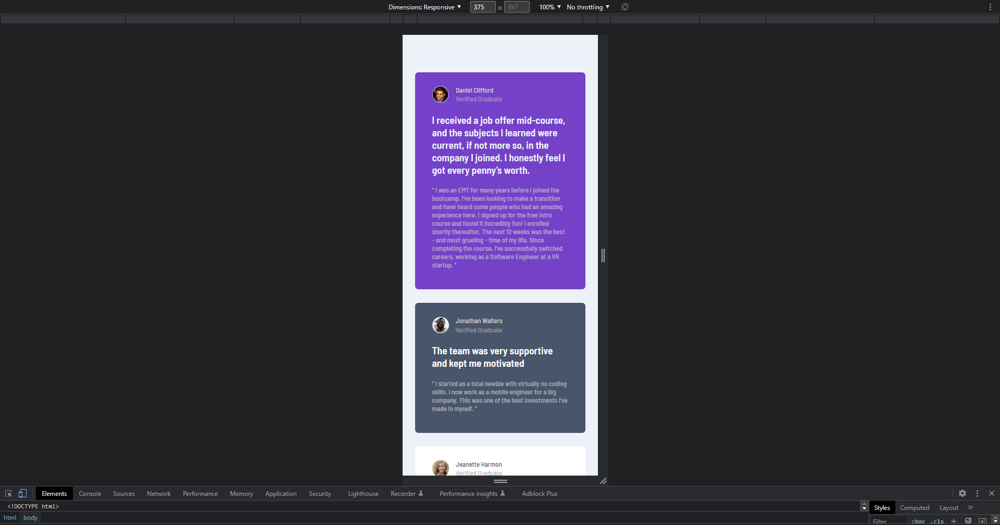

# Frontend Mentor - Testimonials grid section solution

This is a solution to the [Testimonials grid section challenge on Frontend Mentor](https://www.frontendmentor.io/challenges/testimonials-grid-section-Nnw6J7Un7). Frontend Mentor challenges help you improve your coding skills by building realistic projects. 

## Table of contents

- [Overview](#overview)
  - [The challenge](#the-challenge)
  - [Screenshot](#screenshot)
  - [Links](#links)
- [My process](#my-process)
  - [Built with](#built-with)
  - [What I learned](#what-i-learned)
  - [Useful resources](#useful-resources)
- [Author](#author)

## Overview

### The challenge

Users should be able to:

- View the optimal layout for the site depending on their device's screen size

### Screenshot

Desktop:


Tablet:



Mobile:



### Links

- Solution URL: [Add solution URL here](https://your-solution-url.com)
- Live Site URL: [Add live site URL here](https://your-live-site-url.com)

## My process

### Built with

- CSS custom properties
- CSS Grid using grid-column and grid-row properties
- Flexbox
- Desktop-first workflow

### What I learned

How to better place items inside of the grid and how to make them span multiple rows or columns. As well as to manually give grid items a certain position, like done with the tall grid item containing Kira Whittle's testimonial. On the desktop this testimonial is in the third position, while on mobile and in the DOM it is the fifth item.

This is how the grid items are place inside the grid container:

```css
.wide {
  grid-column: span 2;
}

.tall {
  grid-column: 4 / 5;
  grid-row: 1 / 3;
}

@media (max-width: 50em) {
  .grid-container {
    grid-template-columns: 1fr;
    gap: 2em;
    margin: 5.5em 1.85em;
  }

  section {
    padding-block: 2em 3em;
  }

  .wide {
    grid-column: span 1;
  }

  .tall {
    grid-column: span 1;
    grid-row: span 1;
  }
}
```

### Useful resources

- [w3schools.com](https://www.w3schools.com/css/css_grid.asp) - This helped me for looking up the grid syntax to give the grid items a place. When looking for information, I always read articles again from this resource.

## Author

- Website - [MarkVanweersch GitHub Pages](https://markvanweersch.github.io/)
- Frontend Mentor - [@MarkVanweersch](https://www.frontendmentor.io/profile/MarkVanweersch)